# Grafana IRIS REST API Data Source Plugin

[](https://circleci.com/gh/grafana/simple-datasource/tree/master)

## What is this Data Source Plugin?
This is a prototype Grafana IRIS REST API Data Source Plugin. That specifies an endpoint to provide data for display.

## Getting started
### Build the plugin
Navigate to the specific plugin source code in the `grafana-plugins` directory where the package.json resides.
1. Install dependencies
    ```BASH
    yarn install
    ```
1. Build plugin in development mode or run in watch mode
    ```BASH
    yarn dev
    ```
    or
    ```BASH
    yarn watch
    ```
1. Build plugin in production mode
    ```BASH
    yarn build
    ```
### Setup the environment
In the root directory run 
```BASH
docker-compose up -d
```
to load and start a Grafana container.

In your browser navigate to
```
http://localhost:3000
```

Since Grafana only loads plugins on start-up, you need to restart the container whenever you add, remove or modify a plugin.
The easiest development flow is to `docker-compose up` and `yarn watch`, so after any plugin change, in the docker console press Ctrl+C, and start it again, then refresh the Grafana dashboard in the browser.

### Setup the dashboard
Watch a video

[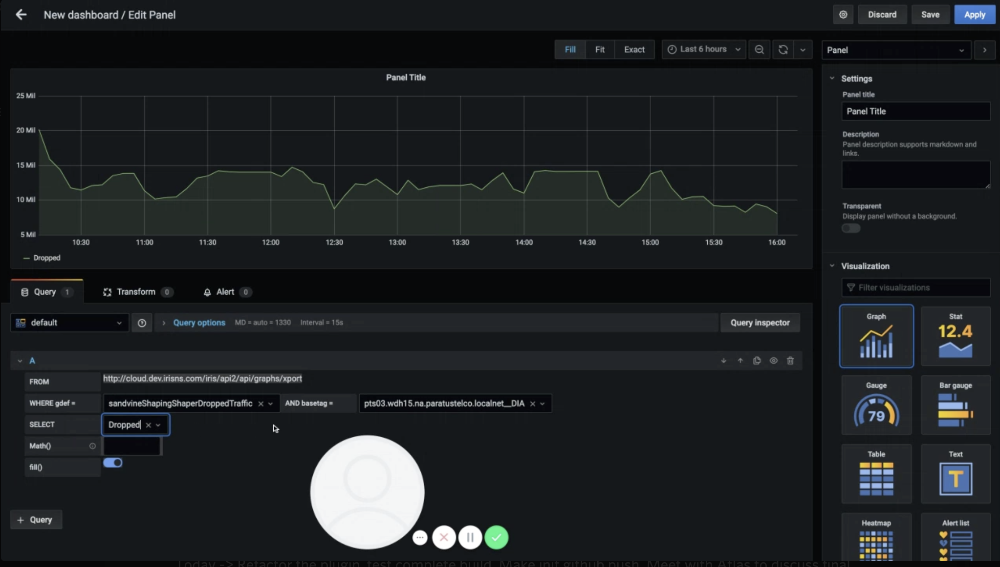](https://www.loom.com/share/d8cc15e7307141039095ba30223c63be)
#### Add the datasource
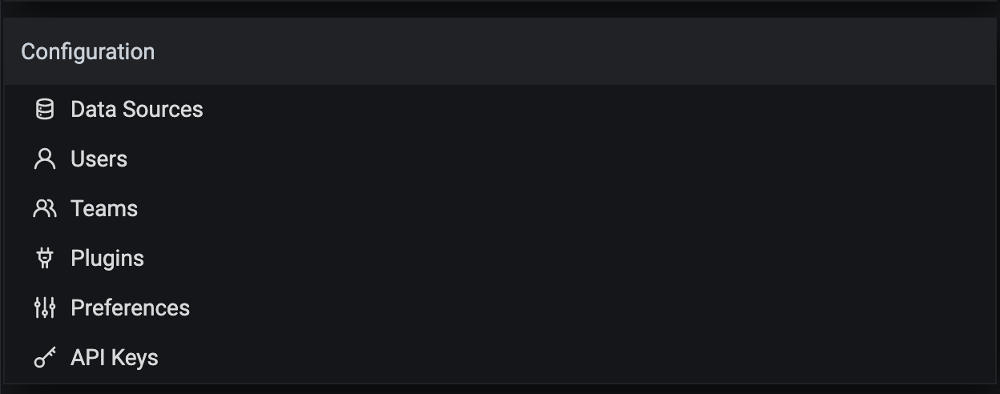

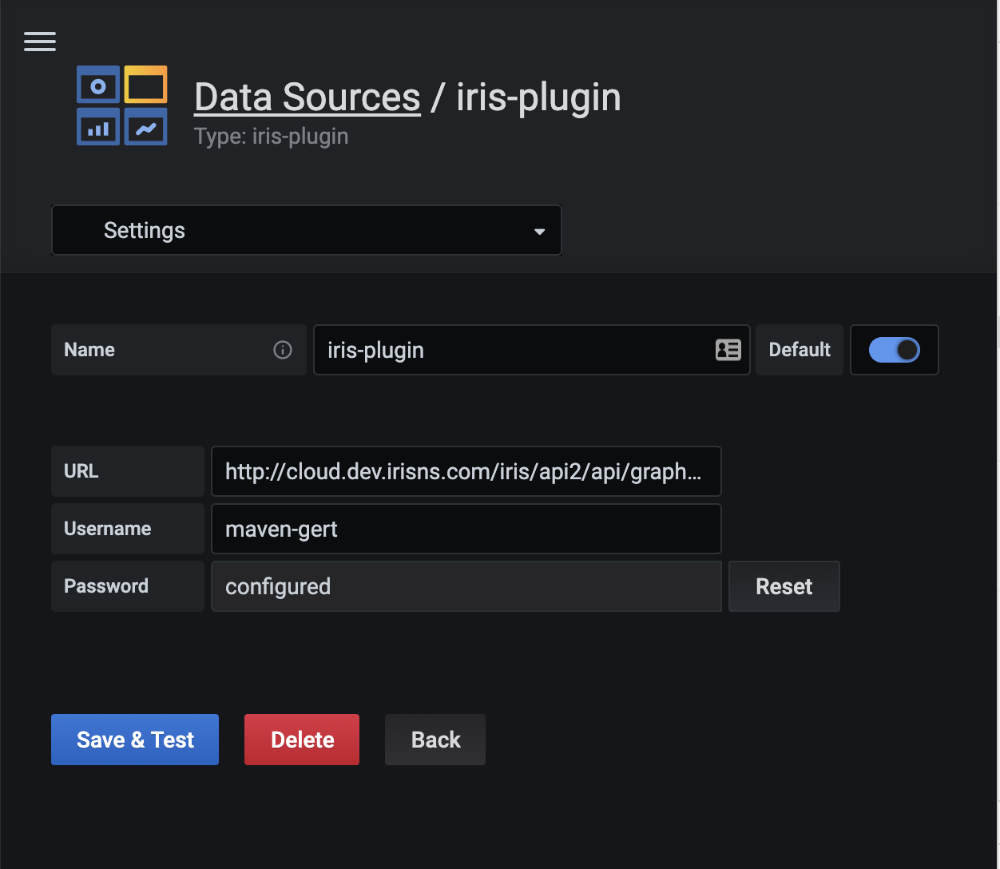

and test it...

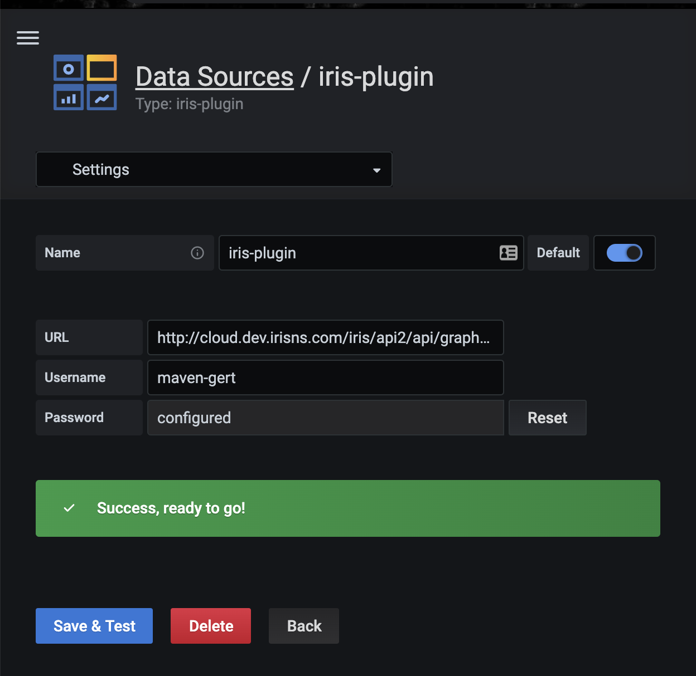
#### Add a dashboard
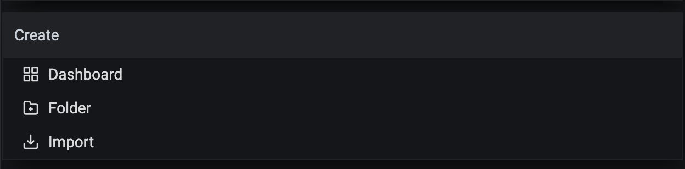

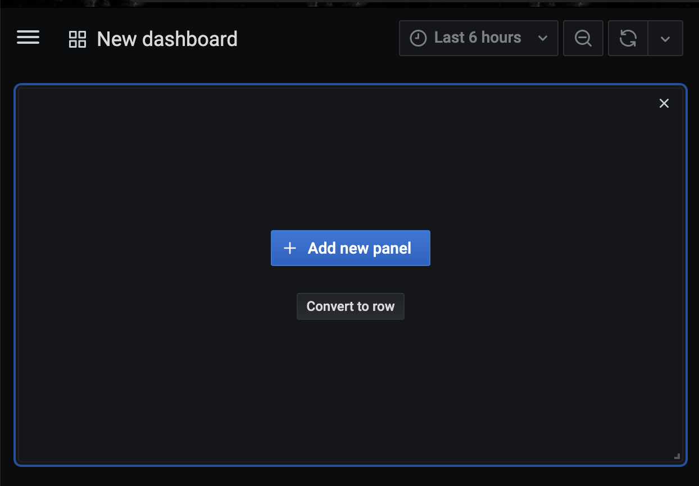
#### Add a panel
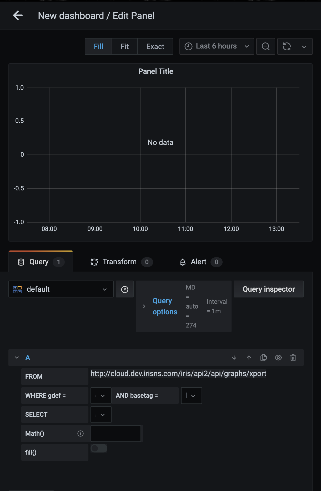
#### Select a `gdef` metric
This is a drop-down with autocomplete functionality. It is currently populated from a static file `basetag-gdef-relation.constants.ts`.

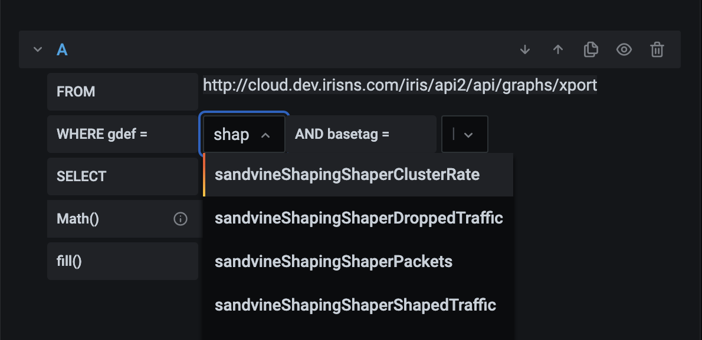
#### Select a `basetag` metric
This is a drop-down with autocomplete functionality, currently fed by the `gdef` selection. Changing it will trigger a request.

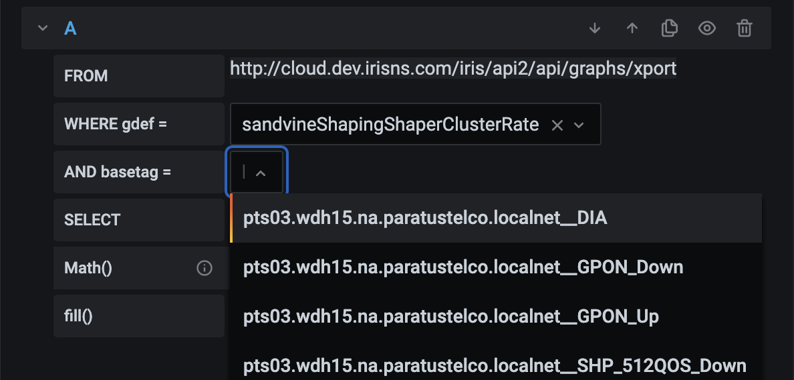
#### Select the `target / label` metric
This is a drop-down with autocomplete functionality, and will be populated only after the response returns. Changing it will trigger a request.

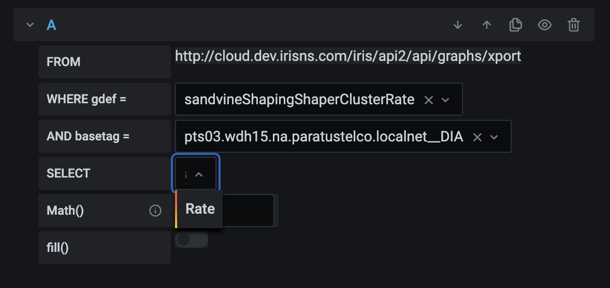

After updating the `gdef` and `basetag` the query fires again and will re-populate the `target / label` drop-down, only changing the `gdef` drop-down will NOT trigger a request.

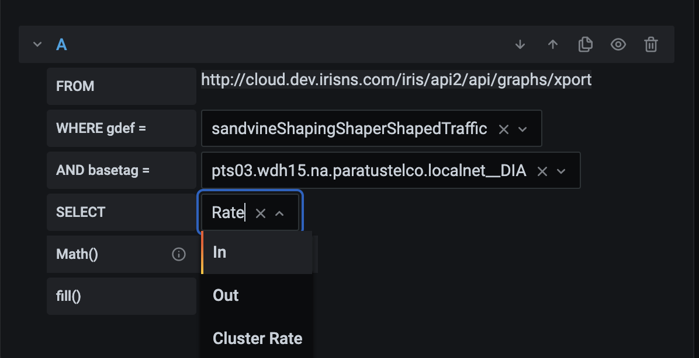
#### Add a second query

The same query will be triggered here, but a different `target / label` can be selected.

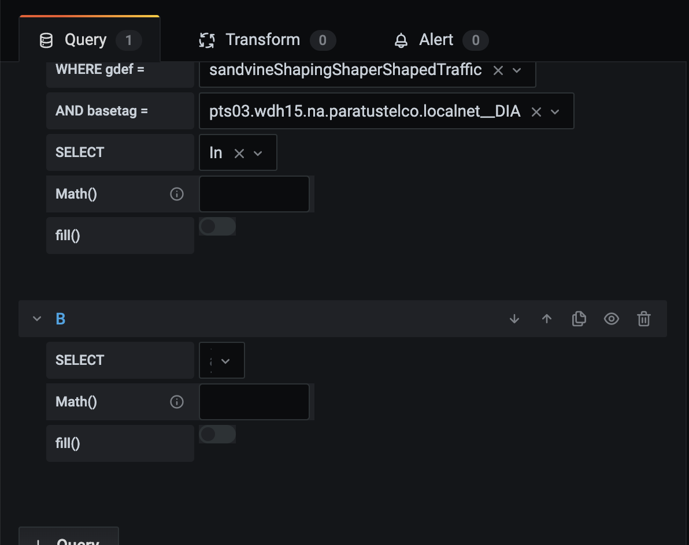
#### Add a math function
For now only simple operations are available ie.`* / - +` using the `targetValue` and the `scaleValue` in this order, but they can easily be expanded to use a Math Parser
like [nerdamer](https://github.com/jiggzson/nerdamer) or [mathjs](https://mathjs.org/docs/expressions/parsing.html).

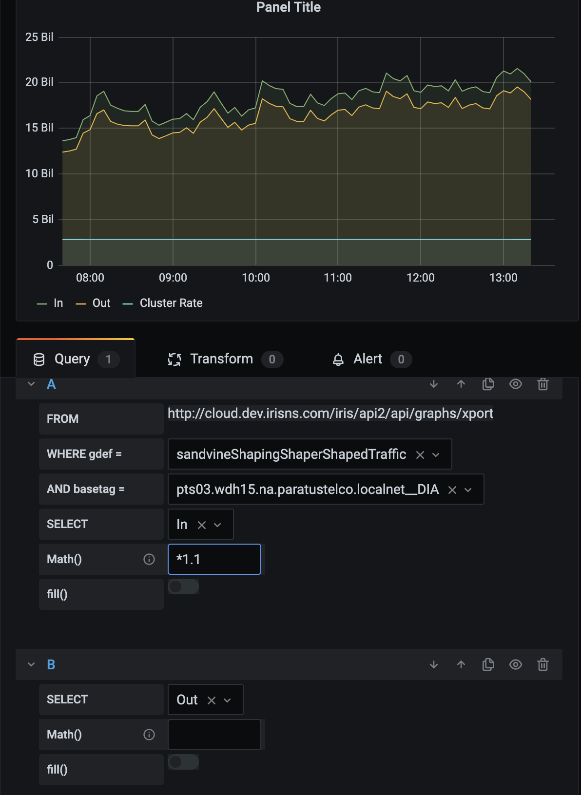

## Request data sample

The request data of type [DataQueryRequest](https://grafana.com/docs/grafana/latest/packages_api/data/dataqueryrequest/#dataqueryrequest-interface).
Fields specific to the query options of type: [DataQuery](https://grafana.com/docs/grafana/latest/packages_api/data/dataquery/#dataquery-interface).

```JSON
{
   "app":"dashboard",
   "requestId":"Q116",
   "timezone":"browser",
   "panelId":23763571993,
   "dashboardId":1,
   "range":{
      "from":"2020-07-29T02:34:18.410Z",
      "to":"2020-07-29T08:34:18.410Z",
      "raw":{
         "from":"now-6h",
         "to":"now"
      }
   },
   "timeInfo":"",
   "interval":"30s",
   "intervalMs":30000,
   "targets":[
      {
         "basetag":"pts03.wdh15.na.paratustelco.localnet__DIA",
         "gdef":"sandvineShapingShaperTraffic",
         "refId":"A",
         "scaleIndex":"*1.05",
         "target":"In",
         "targetOptions":[
            {
               "label":"In",
               "value":"In"
            },
            {
               "label":"Out",
               "value":"Out"
            },
            {
               "label":"Dropped",
               "value":"Dropped"
            },
            {
               "label":"Cluster Rate",
               "value":"Cluster Rate"
            }
         ],
         "datasource":"iris-plugin"
      },
      {
         "refId":"B",
         "target":"Out",
         "targetOptions":[
            {
               "label":"In",
               "value":"In"
            },
            {
               "label":"Out",
               "value":"Out"
            },
            {
               "label":"Dropped",
               "value":"Dropped"
            },
            {
               "label":"Cluster Rate",
               "value":"Cluster Rate"
            }
         ],
         "datasource":"iris-plugin"
      }
   ],
   "maxDataPoints":787,
   "scopedVars":{
      "__interval":{
         "text":"30s",
         "value":"30s"
      },
      "__interval_ms":{
         "text":"30000",
         "value":30000
      }
   },
   "startTime":1596011658411,
   "rangeRaw":{
      "from":"now-6h",
      "to":"now"
   }
}
```

## Response sample
```JSON
{
   "success":true,
   "data":{
      "endtime":1596011400,
      "data":[
         [
            637460212.907774,
            637406418.685522,
            39251.4118192424,
            2800000000
         ],
         [
            607496668.192646,
            607463053.504688,
            30030.1660323633,
            2800000000
         ],
         [
            587735239.993753,
            587493333.371923,
            65519.2641571573,
            2800000000
         ],
         [
            594236658.642874,
            594142578.893916,
            50780.9111808821,
            2800000000
         ],
         [
            596334663.667221,
            596286078.469218,
            45311.6805324459,
            2800000000
         ]
      ],
      "cols":4,
      "step":300,
      "legends":[
         "In",
         "Out",
         "Dropped",
         "Cluster Rate"
      ],
      "starttime":1595990100
   }
}
```


## Helpful links
- [@grafana/ui (a collection of components used by Grafana)](https://developers.grafana.com/)
- [Grafana documenation](https://grafana.com/docs/grafana/latest/)
- [Grafana community](https://community.grafana.com/)
- [Template used for this plugin](https://grafana.com/tutorials/build-a-data-source-plugin)
